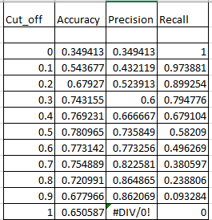

# Prediction of Diabetes 

    

Predictive analysis using Linear Regression in Excel

## Introduction 
Diabetes is a prevalent health issue and predicting its occurrence can aid in early detection. This project aims to predict diabetes using linear regression model in excel

## Data Collection 

The dataset was in gotten from Meriskill project drive, the dataset is in (764, 9) shape, with the attribute as follow 
1.	Pregnancies 
2.	Glucose 
3.	Blood pressure 
4.	Skin thickness 
5.	Insulin 
6.	BMI 
7.	Age 
8.	Diabetes Pedigree Function
9.	Outcome: This attribute is in binary format (0 or 1). 0 is for person without diabetes while 1 represent a diabetics patient.

The dataset contains no duplicate or missing value; however, I normalize each attribute to make sure it's in the correct data type and maintain data integrity. 

## Methodology 
I employed linear regression to model the relationship between the predictor variables and the likelihood of diabetes. This was employed because the outcome, the target variable, is in binary format, and linear regression assumes a linear relationship between the independent variables. 
To get the right model there are certain evaluation metrics performed;

1.	LOGIT: This was calculated by assuming the coefficient for the predictor and also the intercept. Following the general linear formula 
 
   Y= bo + b1x1 +b2x2 …. bnxn
 
   Where b is the coefficient and x represents the predictor value 
   The excel formula used is: = $A$2+SUMPRODUCT(B$2:I$2,B5:I5)

2.	ODD: This is the exponential transformation of the LOGIT parameter. 
Formular= EXP(Logit value)

3.	Probability of success (Diabetes): This is the probability that an entity will have diabetes and this is calculated with the formula: 
=K5/(1+K5)
Where k5 = Values in the ODD column row 5 on the Excel sheet. The value 5 increases down the column. 

4.	Probability of failure: This parameter is used to calculate the probability of not having diabetes. The formula used is:
IF(A8=1,L8,1-L8)
Where column A is the Outcome 
		L is the probability of success
Interpretation: If the outcome is 1(diabetic patient) return the value of probability of success else 1- probability of success. 

5.	Log-likelihood: This is the logarithmic function of the likelihood of diabetes. Formular=LOG(M5) 

6.	Predicted outcome: This is the predicted outcome from the likelihoods. Formular=IF(L10>K$2,1,0)

7.	Sum of Likelihood: This is the total sum of log likelihood. =IF(L10>K$2,1,0)

## Model Evaluation 
1.	After performing this analysis, an evaluation was made of my model by using the confusion matrix table.
   

2.	Relationship curve: I plotted the relationship curve for my model Accuracy, Precision, and Recall. 	This was done to make sure these values complement each other in such a way that I don’t have high accuracy while my precision is low, which will affect the model performance. The evaluation table was generated using WHAT-IF analysis in Excel

      
         : | :        

From the above graph, the maximum accuracy is 0.5 cut-off point while the recall was decreasing, precision also increased with a negative effect on accuracy. 

3.	True Negative (TN): The number of cases where the model correctly predicted the negative class (non-diabetic) when the actual outcome was negative. 

4.	False Positive (FP): The number of cases where the model incorrectly predicted the positive class (diabetic) when the outcome was negative. Also known as type 1 error (false alarm)

5.	False Negative (FN): The number of cases where the model incorrectly predicted the negative class when the actual outcome was positive (predicted non-diabetic but the person is diabetic). Also known as a type II error or miss 

6.	True Positive (TP): The number of cases where the model correctly predicted the positive class when the actual outcome was positive. 

Using the True positive and False positive I plotted my **ROC curve** in other to verify my cut-off point and have a reliable model	

           
      : | :      

_**From the above I calculated my Parameters; Accuracy, Precision, and Recall**_

- **Accuracy**: It measures the overall correctness of predictions made by the model. It calculates the ratio of correctly predicted instances (both negative and positive instances) to the total number of instances.
Formular= (True Positives +True Negative)/Total prediction
- **Precision**: It quantifies the accuracy of positive predictions made by the model. It is very crucial when looking to minimize false positives. 
Formular= True Positives/(True positives + False positives)
- **Recall**: It measures the ability of the model to correctly identify positive instances out of all actual positive instances.
Formular= True Positives/(True positives + False Negative)

 

## Results

The model achieved an accuracy of 78.10%, a precision of 73.58%, and a Recall of 58.21%. These metrics indicate the model’s ability to correctly identify diabetic cases. Other evaluation was considered such as the F1-score to provide a comprehensive assessment.

 

## Discussion
The analysis results suggest that this model is moderately accurate in predicting diabetes. The cutoff point impacts the model’s performance and further fine-tuning may improve accuracy. 

# Conclusion
In conclusion, this project demonstrates the potential of using linear regression in Excel for diabetes predictions. While the shows a good start there is room for considering additional variables. 

### Skills Improvement
This project has increased my skill with Microsoft Excel, while brainstorming on how to have a good model, I learned how to use Solver adds-in and perform what-if analysis. 

**Contact Mail**: [Mail](aderounmuabrax@gmail.com)

